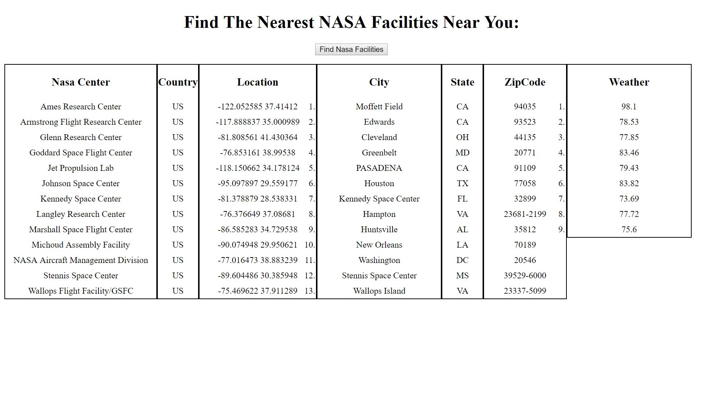

Nasa Complex API
This app displays Nasa center information along with the weather for each NASA center.

Link to project:https://rakimdevcraig.github.io/nasaComplex/

How It's Made:
Tech used: HTML, CSS, JavaScript, jQuery, API
This was built ontop of my existing Nasa facilities API. What I did was add another list to the HTML in which the weather would be displayed. After doing that I used Javascript to make an ajax request to the openweathermap
API, if that request was successful the parameters we chose which was the weather would be appended into the ul we set.

Optimizations:
Unfortunately the API I used doesn't have weather for some cities that have nasa facilities so some cities don't have a weather. If I have a chance I will go back and find an API that has weather for each location.

Lessons Learned:
At first our temperatures was displaying in Kelvin units. We didn't want that we wanted it to display in Fahrenheit. I went back and the documentation stated that I had to change a parameter in my apiURL so once I did that the temperature no longer displayed in kelvin and instead displayed in Fahrenheit which I am much more comfortable with.

Examples:
Take a look at these couple examples that I have in my own portfolio:
